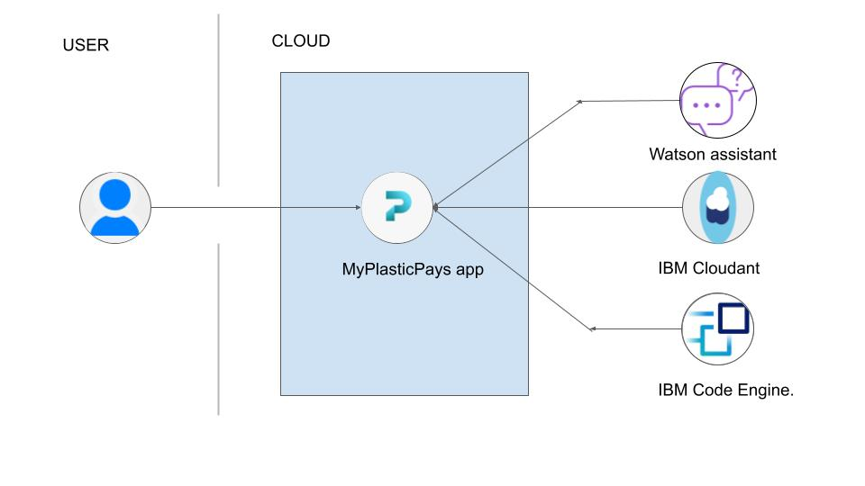
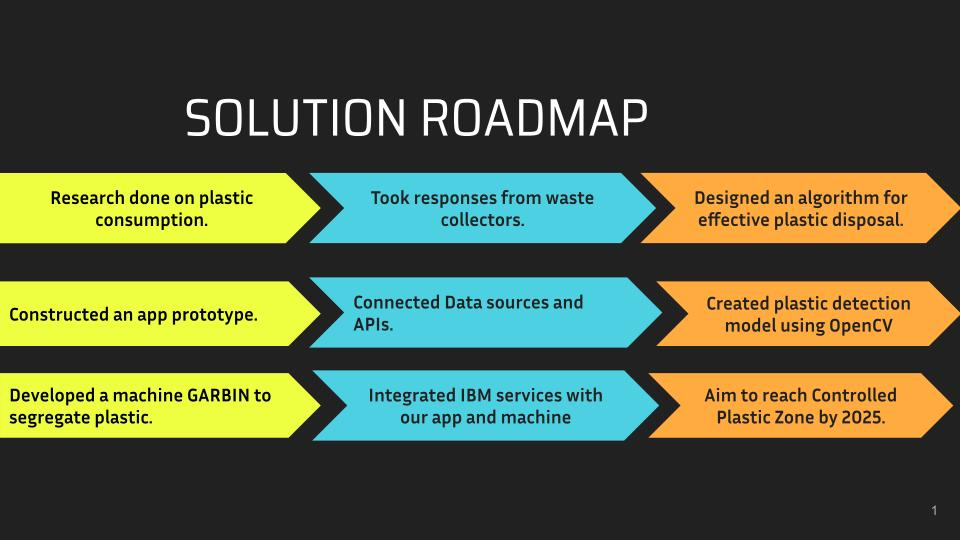

# My Plastic Pays

## Contents

- [Project Name](#My-Plastic-Pays)
- [About the project](#about-the-project)
  - [What's the problem?](#whats-the-problem)
  - [How can technology help?](#how-can-technology-help)
  - [The idea](#the-idea)
- [Demo video](#demo-video)
- [The architecture](#the-architecture)
- [Long description](#long-description)
- [Project roadmap](#solution-roadmap)
- [Getting started](#getting-started)
- [Live demo](#live-demo)
- [Built with](#built-with)
- [Contributing](#contributing)
- [Authors](#authors)

## About The Project

### What's the problem?

Plastic disposal in public places with no convenient or cost-effective disposal methods leads to difficulty in segregation and makes recycling a hectic job for waste collectors.
Moreover, non biodegradable wastes harm the ecosystem affecting all organisms in the long run. Plastic waste also makes animal lives miserable.

### How can technology help?

We implement our model using AI and deep learning through OpenCv to identify the plastic bottles and cans making segregation easier.
MyPlasticPay app works as a bin tracker and rewarding channel through which you can contribute your part to the environment.

### The Idea

  It is essential that we have to preserve our surroundings for the well being of our future generations. With the help  of a set of  open source tools, backed by IBM Cloud and Watson Services, our GARBIN machine paves an innovative and cost-effective way to deposit plastic wastes making segregation and recycling process a lot easier.

## Demo video

link- `https://youtu.be/o37L91SnWbw`

## Architecture

1. The user interacts with GARBIN(plastic depositing bin) and acquires a QR code. Scanning the QR code leads to the download of MyPlasticPays app.
2. Watson assistant - To build conversational flow between the app and the user.
3. IBM Cloudant- A NoSQL database to store the data of users.
4. IBM Code Engine - To run the app on a managed serverless platform.

## Long Description

[Detailed description is available here](./docs/DESCRIPTION.md)

## Solution RoadMap

## Getting Started

1. Install this - in your Android mobile/emulator and just start the application.
2. Run the python -- with open cv installed in the system 

## Live Demo

- - view
- 

## Built With

- [IBM Cloudant](https://cloud.ibm.com/catalog?search=cloudant#search_results) - The NoSQL database to store data of users.
- [IBM Code Engine](https://cloud.ibm.com/catalog?search=engine#search_results) - Tool for deployment of applications.
- [Watson Studio](https://cloud.ibm.com/catalog/services/watson-studio) -Tool to build the objection detection model using AI and Deep Learning.
- [Watson Assistant](https://cloud.ibm.com/catalog/services/watson-assistant) - Used to build conversational flows between the app and users.

## Contributing

### Pull Request Process

1. Fork the repository. 
2. Commit your changes to your fork. 
3. Submit a pull request.
4. Handle any feedback before the request is merged.
5. Accept our sincere Thank You!

## Authors

- **Abhinav Thomas**  - [abhitom2000](https://github.com/abhitom2000)
- **Aadhya K Raj**  - [aayahda](https://github.com/aayahda)
- **Anjana K T**  - [anjanakt](https://github.com/anjanakta)

